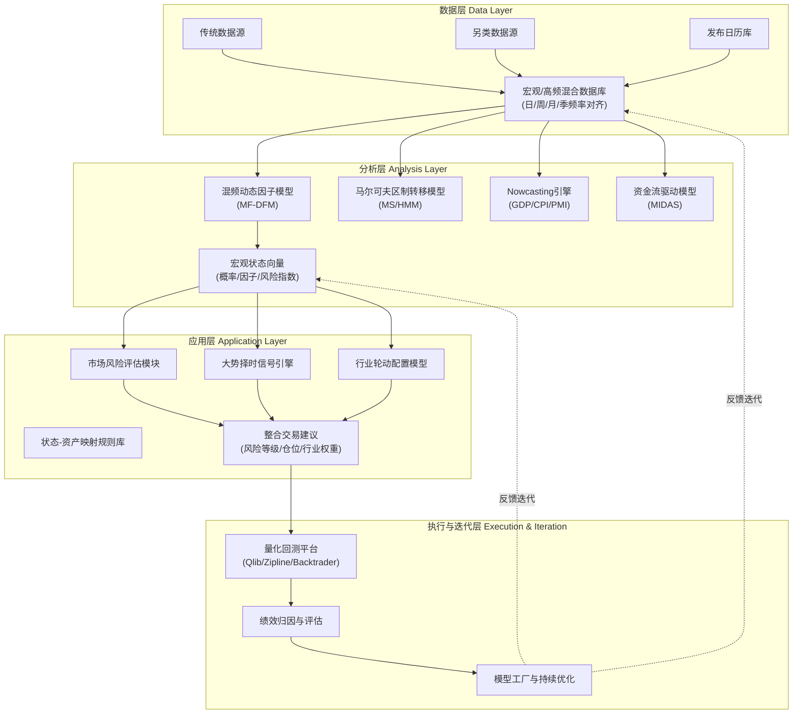

# 融合Nowcasting与动态因子模型的宏观交易框架：基于中美双核分析下的资产配置与择时应用

## 第一章：绪论——定义框架的目标、范围与核心挑战

本报告旨在构建一个**系统化、可编程实现的量化宏观分析体系**，其核心使命是服务于中短期（3日至90日）波段交易决策。与传统宏观研究的描述性分析不同，本框架追求**直接的交易指引输出**，具体化为三大核心产出：

1.  **市场整体风险评估**：动态识别系统性风险的积聚与释放状态。
2.  **大势择时信号**：提供基于宏观状态演变的仓位调整（进攻/防御）建议。
3.  **行业轮动建议**：在不同宏观场景下，给出超配与低配的行业配置权重。

**核心挑战**在于弥合低频宏观数据与高频交易决策之间的鸿沟，并克服传统分析中主观判断过多、信号模糊的弊端。本框架的解决思路是**深度融合传统宏观理论、另类高频数据与前沿计量/机器学习模型**，特别是通过**混频数据处理（MIDAS）** 与**动态因子模型（DFM）** 实现经济状态的实时感知（Nowcasting），并通过**量化映射模型**将宏观状态概率转化为具体的资产价格预期与交易规则。

## 第二章：宏观经济分析的四大支柱与状态识别理论

宏观经济的运行可由**增长、通胀、流动性、政策**四大支柱的系统性互动来刻画。本框架以此为基础，关键在于将定性的宏观叙事转化为**可量化的状态变量**。

我们引入 **Hamilton (1989) 的马尔可夫区制转移模型**作为理论基础。该模型允许经济在有限个离散状态（如“扩张”与“衰退”、“高通胀”与“低通胀”）之间切换，且转移概率由数据驱动估计。这与**隐马尔可夫模型（HMM）** 一脉相承，为量化定义宏观经济状态提供了严谨的数学框架。

**前沿实践深化**：2023-2024年国内头部量化私募（如幻方、九坤）的实践表明，简单的两状态模型已不足够。基于中国数据，识别 **“复苏”、“过热”、“滞胀”、“衰退”** 四状态模型，或更精细的“宽松”、“紧缩”等流动性状态，对资产配置的指导意义更强。状态识别是动态的，使用**混频数据**（如月度工业增加值、周度交通流量、日度利率）通过MS模型或HMM进行实时估计，输出的**状态概率时间序列**本身即是核心的宏观因子。

## 第三章：核心数据战略：传统、另类数据源与Nowcasting实践

数据层是本框架的基石，需构建一个兼顾深度、广度和时效性的混合数据体系。

### 3.1 传统与高频数据源扩展
*   **美国**：以FRED为核心，补充纽约联储、圣路易斯联储的高频经济指数。
*   **中国**：在Wind、Tushare Pro的基础上，必须纳入以下**高频数据**：
    *   **流动性指标**：日度Shibor、R/DRO07利差（流动性分层）、同业存单发行利率与MLF利差。
    *   **货币市场数据**：通过森浦（QB）、普兰金服获取票据转贴现利率的实时报价，作为短期资金面紧张的敏感指标。
    *   **经济活动代理**：高德/百度地图的**城市交通拥堵指数**（日度）、G7物联的**全国公路货运流量指数**（周度）、重点港口的集装箱吞吐数据。

### 3.2 另类数据的战略应用
另类数据用于捕捉官方统计的“盲区”和领先信号。
*   **卫星与物联网数据**：佳格天地等的**夜间灯光指数**、**工业园区热力分布**，用于Nowcasting区域工业生产强度。
*   **互联网行为数据**：**百度指数**（用于构建消费热度、就业关注度指数）、阿里指数、QuestMobile的App活跃度数据。
*   **供应链数据**：追踪大宗商品物流、关键零部件发货量，用于产业链压力预警。

### 3.3 Nowcasting模型的工程化实现
目标是实现对GDP、CPI等低频关键指标的实时预测。技术核心是处理**混频数据**与**锯齿状末端数据**。
1.  **方法论**：采用**混频数据抽样模型**与**混频动态因子模型**。前者（如MIDAS回归）直接利用高频变量预测低频目标；后者（MF-DFM）通过状态空间模型从混频数据中提取潜在经济因子，进而推算目标变量。
2.  **中国实践**：直接复用或借鉴**中国人民银行研究局公开的MF-DFM Nowcasting模型**（MATLAB代码）及其Python生态移植版本（如`nowcast-dfm`）。该框架已系统解决中国数据的发布延迟和春节效应等问题。
3.  **软因子集成**：将基于NLP的**文本情绪因子**（如分析央行货币政策报告、财经新闻的情感得分）作为额外的月度/周度指标输入DFM，可显著提升政策转折期的Nowcasting精度。
4.  **系统工程**：构建自动化管道，使用**Airflow/Prefect**调度，以事件驱动方式在数据发布后自动触发模型更新，结果存入**TimescaleDB/ClickHouse**，并通过**Streamlit/Plotly Dash**仪表板实时展示预测路径与不确定性区间。

## 第四章：动态因子模型与领先指标体系的构建

面对海量宏观与另类数据，动态因子模型用于**降维**与**去噪**，提取驱动经济周期的少数共同因子。

1.  **模型核心**：从数十甚至数百个相关经济序列中，提取2-3个**共同因子**（可解释为“经济增长因子”、“通胀因子”、“金融条件因子”）。使用**卡尔曼滤波**或**EM算法**进行估计，能自然处理缺失数据。
2.  **技术优化**：超越传统PCA，采用**稀疏PCA**提高因子可解释性，或探索**变分自编码器**捕获非线性关系。使用**Varimax旋转**使因子载荷结构更清晰，便于经济含义解读。
3.  **领先指标体系构建**：参考**OECD复合领先指标**方法论，但进行本土化定制。基于DFM提取的因子以及挑选出的关键高频指标（如社融增速、M1-M2剪刀差、铜价、交通流量），构建针对中国股市周期的**定制化领先指标**。通过计算与股市指数的**时差互相关**，并在样本外滚动测试中验证其领先期数（通常为1-3个月）与预测有效性。

## 第五章：中美宏观双核分析：核心传导渠道与交互机制

本章聚焦中美宏观经济与金融市场的联动，这是影响资产价格的关键外生变量。

### 5.1 利率与汇率渠道：资本流动的定价锚
*   **驱动因子深化**：北向/南向资金流已不能简单用名义利差解释。构建三层驱动模型：
    *   **全球层**：VIX指数（全球风险偏好）、美元指数。
    *   **相对吸引力层**：**中美实际利差**（TIPS收益率 vs. 中国通胀预期）、**经中国EPU指数折价后的增长预期差**。
    *   **市场微观层**：AH股溢价指数、USDCNH风险逆转期权。
*   **资金流Nowcasting**：应用**MIDAS回归**，将上述月度、周度宏观因子与**日度北向资金净流入**建模，实现对未来1-5日资金流的预测。将预测结果作为独立的“外资情绪因子”。

### 5.2 产业链与通胀传导渠道：利润再分配的逻辑
*   **PPI-CPI剪刀差的核心作用**：此差值直接映射利润在产业链上下游的再分配。建立定量模型：
    *   **上游通胀暴露度**：计算行业指数与南华工业品指数的滚动Beta。
    *   **下游定价权**：综合行业毛利率稳定性、集中度(CR3)构建因子。
    *   **传导时滞**：实证表明，上游价格变动传导至中游PPI约**1-3个月**，至下游CPI及股价约**3-6个月**，且存在不对称性。
*   **结构性冲击**：将 **“双碳”政策强度**、**供应链安全关注度**作为调节变量，纳入传统价格传导模型，以解释新能源产业链和国产替代板块的独立逻辑。

### 5.3 市场互联与风险传导
*   **价格发现与波动率溢出**：北向资金在A股大盘股的价格发现贡献度平均超**30%**。使用**DCC-GARCH/BEKK-GARCH**模型量化证实，A股向港股的波动率溢出强度显著高于反向。当北向资金单日净流出超**100亿元**时，会显著推高未来1-3日A股和港股的波动率预期。
*   **复合风险预警指数**：融合微观指标构建系统性风险仪表盘：
    | 维度 | 核心指标 | 预警阈值 |
    | :--- | :--- | :--- |
    | **市场情绪** | 期权波动率曲面偏度(Skew) | 左偏至极值(>90%分位数) |
    | **流动性压力** | R007-DR007利差，信用利差(AA-AAA) | 突破一年内90%分位数 |
    | **杠杆水平** | 融资交易占比 | 持续高于12% |
    | **外资行为** | 北向资金5日累计净流出Z-score | 小于-2 |
    | **宏观状态** | Nowcasting模型输出的“衰退”概率 | 突破40%并上升 |
    *   **合成方法**：采用**动态机器学习赋权**（如XGBoost），根据各指标对预测未来市场回撤的贡献度分配权重，生成0-100的综合风险指数。

## 第六章：从宏观状态到资产价格的量化映射模型

本章是框架的“应用层”，旨在将宏观分析转化为直接的投资决策。

### 6.1 市场整体风险评估模型
*   **输入**：第五章的**复合风险预警指数** + Nowcasting输出的**宏观状态概率**。
*   **输出**：市场整体的风险等级（如低、中、高）及对应的预期波动率区间。当风险指数与“滞胀/衰退”概率同时高企时，发出最高级别警报。

### 6.2 大势择时模型
*   **多因子打分系统**：构建一个动态打分卡，因子包括：
    1.  **宏观状态分**：基于MS模型，对“复苏”、“扩张”状态赋正分，“滞胀”、“衰退”赋负分。
    2.  **流动性分**：货币信用条件（社融增速、M1-M2剪刀差）的边际变化方向。
    3.  **估值分**：股债风险溢价（ERP）的当前分位数。
    4.  **外资情绪分**：由5.1节产生的“外资情绪因子”标准化得分。
*   **信号生成**：设定总分阈值，触发“增仓”、“减仓”、“中性”信号。需回测确定最优阈值和因子权重。

### 6.3 行业轮动模型
*   **宏观状态-行业表现数据库**：基于历史数据，量化不同宏观状态下（如“复苏”、“过热”、“滞胀”、“衰退”）中美股市各行业的平均超额收益、胜率和宏观因子敏感性。
*   **敏感性因子库**（以A股为例）：
    *   **对PPI敏感**：煤炭、石化（Beta>1.5，正）；汽车、家电（Beta<-0.7，负）。
    *   **对利率敏感**：食品饮料、医药（利率下行期Beta 0.3-0.5，正）；银行（利率下行期Beta -0.4，负）。
    *   **对信用敏感**：建筑、建材（对社融增速敏感）；环保、中小制造（对信用利差走阔敏感，负）。
*   **轮动逻辑**：
    1.  根据当前Nowcasting输出的主导宏观状态，选择历史上在该状态下表现优异的行业池。
    2.  根据当前宏观因子（如PPI走势、利率方向）的边际变化，在行业池内进一步筛选敏感性匹配的行业。
    3.  引入**行业动量**与**资金流因子**（北向/南向资金持续流入的行业）作为战术调整和确认信号。
    4.  输出行业权重建议清单。

## 第七章：回溯测试、风险控制与框架迭代流程

### 7.1 回测引擎选择与混频数据适配
*   **平台对比**：**Qlib**（表达式引擎原生支持发布延迟，适合AI因子）、**Zipline**（Pipeline API清晰，需定制`CustomFactor`处理日历）、**Backtrader**（最灵活，但需从零实现数据延迟逻辑）。
*   **关键挑战解决**：必须构建**宏观数据日历对齐器**。回测时，任何宏观指标在`t`日的可用值，必须是截至`t`日**实际已发布**的最新数据，严禁使用自然月末简单前向填充。这需要通过发布日历表进行精确映射。

### 7.2 标准化回测与评估流程
1.  **伪实时回测**：在每个历史时点，仅使用当时已发布的信息重新估计所有模型（Nowcasting、状态识别、因子模型），进行样本外预测和交易。
2.  **绩效评估**：不仅看年化收益、夏普比率，更关注**最大回撤、Calmar比率**，以及信号在 **2015、2018、2022** 等极端年份的表现。
3.  **归因分析**：将策略收益分解为**宏观择时（仓位）、行业轮动、个股选择**三部分的贡献。

### 7.3 风险控制与仓位管理
*   **基于风险的仓位缩放**：将**复合风险预警指数**映射为仓位上限（如高风险期仓位≤50%）。
*   **状态持续性管理**：利用MS模型估计的**状态转移概率**和平均持续期（如高风险状态平均持续15-20天），决定防御性仓位的持有时间。
*   **尾部风险应对**：当多个预警指标同时触发（“三级预警”），执行强制性降仓或对冲。

### 7.4 框架迭代机制
*   **定期评估**：每月/季度评估各模块（Nowcasting、领先指标、轮动模型）的样本外预测精度。
*   **模型工厂**：利用并行计算，持续测试新数据源、新因子、新机器学习模型（如Gradient Boosting、神经网络）的增量贡献，采用**模型置信集检验**进行筛选。
*   **版本化管理**：使用**MLflow/DVC**对数据、代码、模型参数和回测结果进行全链路版本控制。

## 第八章：结论与实施路线图

本框架提供了一个从宏观机理到交易执行的**完整、量化、可回溯的决策链条**。其核心价值在于将离散的宏观信息转化为连续的、可概率化的状态判断，并通过历史验证过的映射关系驱动投资组合调整。

### 实施路线图（分三步走）

**第一阶段：数据基础设施与Nowcasting模块搭建 (1-2个月)**
*   **目标**：实现核心数据的自动化获取、清洗与存储，并产出稳定的Nowcasting预测。
*   **关键任务**：
    1.  搭建数据管道，集成Wind/Tushare API、另类数据源（百度指数、交通数据）。
    2.  实现中国人民银行的MF-DFM Nowcasting模型，并完成历史回测。
    3.  构建宏观数据日历数据库，为回测奠定基础。

**第二阶段：状态识别、因子模型与风险预警开发 (2-3个月)**
*   **目标**：产出宏观状态概率、动态因子、领先指标及综合风险指数。
*   **关键任务**：
    1.  基于混频数据实现马尔可夫区制转移模型（MS），输出宏观状态概率。
    2.  构建动态因子模型，提取经济增长、通胀等核心因子。
    3.  开发并回测复合系统性风险预警指数。
    4.  完成中美资金流驱动因子分析与Nowcasting模型。

**第三阶段：映射模型集成、回测平台构建与全面验证 (2-3个月)**
*   **目标**：形成完整的端到端策略，并完成历史业绩验证。
*   **关键任务**：
    1.  开发大势择时多因子打分系统和行业轮动模型。
    2.  选定回测平台（建议Qlib或Zipline），完成宏观数据适配器的开发。
    3.  对2016年以来的历史进行全周期、伪实时的回测，生成详细的绩效与归因报告。
    4.  构建监控仪表盘，实现核心指标（风险指数、状态概率、预测值）的日常可视化。

通过以上三步，即可将一个研究级框架转化为一个可交付、可监控、可迭代的**量化宏观交易系统**。

## 参考文献
1.  Hamilton, J. D. (1989). A new approach to the economic analysis of nonstationary time series and the business cycle. *Econometrica*.
2.  OECD Composite Leading Indicators (CLI) Methodology.
3.  New York Fed Nowcasting Report & Technical Documentation.
4.  中国人民银行研究局. 《中国经济实时预测模型》技术文档与代码 (2023).
5.  中金公司量化策略团队. 《北向资金流分解模型与驱动因子研究》系列报告 (2024).
6.  国泰君安证券金工团队. 《基于宏观状态识别的行业配置模型》 (2024).
7.  华泰证券金融工程部. 《系统性风险多维度预警体系构建》 (2023).

## 附录：完整研究框架构建思路

