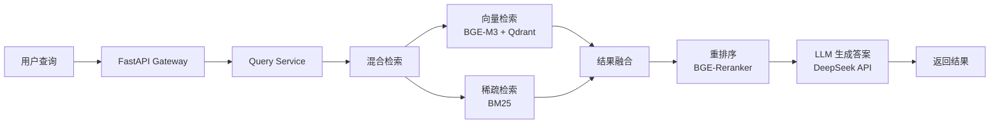

# Indeptrader 本地 AI 知识库系统构建方案

> 基于深度研究报告《构建面向复杂分析的本地知识库系统：架构、实现与演进路线深度指南》

## 项目背景与需求分析

### 用户需求
- **知识库内容**：
  - 业务领域知识（宏观经济、金融概念、交易策略）
  - 项目文档和说明（架构设计、API 集成、开发日志）
  - 外部参考资料（研究论文、行业报告、FRED/BLS 文档）
  - 项目代码和架构知识（JavaScript、Chart.js、数据处理）
  - 个人生活信息

- **使用场景**：
  - 代码理解与重构
  - 新功能开发
  - 问题排查与调试
  - 自动化任务执行

- **更新方式**：手动触发

### 当前项目环境
- **项目类型**：纯前端静态页面（HTML/CSS/JavaScript + Chart.js）
- **数据获取**：Python 脚本从 FRED/BLS API 获取数据，存储为 CSV
- **已有 MCP 工具**：
  - **Serena**：代码知识库，符号搜索、引用查找、记忆系统
  - **CKB**：代码知识库，架构分析、影响分析
  - **Deep Research**：深度研究和报告生成（http://localhost:3000）
  - **Firecrawl/Bright Data/Tavily**：网页抓取和搜索
  - **Context7**：库文档获取

### 数据特性分析
根据深度研究报告，本项目具有**多源异构数据**特点：
1. **源代码**：严格语法结构、跨文件引用关系、专业符号
2. **Markdown/文本笔记**：相对结构化，需保持逻辑连贯性
3. **PDF/Word 金融研究报告**：复杂格式，包含表格、图表、非连续文本

---

## 核心技术选型（基于 2024-2025 前沿研究）

### 方案对比总览

| 方案 | 核心技术 | 复杂度 | 硬件需求 | 适用场景 | 推荐指数 |
|------|----------|--------|----------|----------|----------|
| **方案 A** | Obsidian + Obsidian MCP | ⭐⭐ 低 | 500MB RAM | 快速上手、知识管理优先 | ⭐⭐⭐⭐ |
| **方案 B** | 轻量级 RAG 系统 | ⭐⭐⭐⭐ 中 | 8-16GB RAM | 需要语义搜索和智能问答 | ⭐⭐⭐⭐⭐ |
| **方案 C** | 生产级知识库系统 | ⭐⭐⭐⭐⭐ 高 | 64GB RAM + GPU | 大规模、专业级应用 | ⭐⭐⭐⭐⭐ |

---

## 推荐实施路径：渐进式演进

### 阶段一：Obsidian 基础知识库（快速起步，1-2 周）

**目标**：建立轻量级知识管理系统，与现有 MCP 工具协同工作

#### 技术栈
- **Obsidian**：知识库管理
- **Obsidian MCP**：https://github.com/iansinnott/obsidian-claude-code-mcp
- **推荐插件**：Dataview（查询）、Graph Analysis（知识图谱）、Advanced Tables

#### 目录结构
```
~/Indeptrader-Knowledge/Vaults/
├── business-knowledge/          # 业务领域知识
│   ├── Macroeconomics/          # 宏观经济
│   ├── Finance/                 # 金融概念
│   └── Trading-Strategy/        # 交易策略
├── project-docs/                # 项目文档
│   ├── Architecture.md
│   ├── API-Integration.md
│   └── Development-��og.md
├── research-reports/            # 研究报告（从 Deep Research 同步）
└── code-knowledge/              # 代码知识（链接到 Serena/CKB）
```

#### 实施步骤
```bash
# 1. 安装 Obsidian（10 分钟）
# https://obsidian.md/download

# 2. 创建 Vault 结构（15 分钟）
mkdir -p ~/Indeptrader-Knowledge/Vaults
cd ~/Indeptrader-Knowledge/Vaults
mkdir -p {business-knowledge,project-docs,research-reports,code-knowledge}

# 3. 安装 Obsidian MCP（15 分钟）
claude mcp add obsidian \
  "npx -y @iansinnott/obsidian-claude-code-mcp" \
  ~/Indeptrader-Knowledge/Vaults

# 4. 验证安装
claude mcp list
```

#### 自动化脚本
**`~/Indeptrader-Knowledge/Scripts/sync-research.py`**：
```python
#!/usr/bin/env python3
import os
from datetime import datetime

SOURCE_DIR = "/home/shang/git/Indeptrader/deep-research report"
TARGET_DIR = "/home/shang/Indeptrader-Knowledge/Vaults/research-reports"

for filename in os.listdir(SOURCE_DIR):
    if filename.endswith('.md'):
        with open(f"{SOURCE_DIR}/{filename}", 'r') as f:
            content = f.read()

        frontmatter = f"""---
tags: [research, report]
date: {datetime.now().strftime('%Y-%m-%d')}
source: deep-research
---

"""
        with open(f"{TARGET_DIR}/{filename}", 'w') as f:
            f.write(frontmatter + content)
```

**`~/Indeptrader-Knowledge/Scripts/update.sh`**：
```bash
#!/bin/bash
echo "🔄 更新 Obsidian 知识库..."
python3 ~/Indeptrader-Knowledge/Scripts/sync-research.py
echo "✅ 完成！"
```

#### 成本评估
- 时间：3-5 小时
- 硬件：500MB RAM，1-5GB 磁盘
- 技术难度：⭐⭐

---

### 阶段二：轻量级 RAG 系统（语义搜索，2-4 周）

**目标**：基于深度研究报告构建专业的 RAG 系统

#### 技术栈（基于 2024-2025 前沿研究）

| 组件 | 推荐选择 | 理由 |
|------|----------|------|
| **嵌入模型** | **BGE-M3-base** 或 **Jina Embeddings v3-base** | MTEB/MIRACL 2024-2025 顶级性能，支持多语言和长文本 |
| **向量数据库** | **Qdrant**（推荐）或 **LanceDB** | Qdrant 性能最优，LanceDB 内存效率高 |
| **推理引擎** | **DeepSeek API** 或 **本地 Qwen2.5-Coder-7B**（有 GPU） | DeepSeek API 便捷，本地模型隐私 |
| **解析器** | **unstructured** + **LlamaIndex** | 支持多格式（PDF、Word、Markdown） |
| **重排序** | **BGE-Reranker-v2**（可选） | 提升检索精度 5-15% |

#### 系统架构



#### 目录结构
```
~/rag-knowledge-system/
├── docker-compose.yml           # Docker 部署配置
├── .env                         # 环境变量
├── src/
│   ├── api/
│   │   └── main.py             # FastAPI Gateway
│   ├── services/
│   │   ├── query_service.py    # 查询服务
│   │   ├── retriever.py        # 检索器
│   │   └── reranker.py         # 重排序
│   ├── pipelines/
│   │   ├── parser.py           # 文档解析
│   │   ├── chunker.py          # 分块策略
│   │   └── embedder.py         # 嵌入生成
│   └── models/
│       ├── embeddings.py        # 嵌入模型
│       └── llm.py              # LLM 接口
├── data/
│   ├── documents/              # 原始文档
│   ├── processed/              # 处理后的数据
│   └── qdrant/                 # Qdrant 数据存储
└── scripts/
    ├── ingest.py               # 文档导入脚本
    ├── update.py               # 更新知识库
    └── query.py                # 查询测试脚本
```

#### Docker 部署配置

**`docker-compose.yml`**：
```yaml
version: '3.8'

services:
  qdrant:
    image: qdrant/qdrant:v1.12.0
    ports:
      - "6333:6333"
    volumes:
      - ./data/qdrant:/qdrant/storage
    environment:
      - QDRANT__SERVICE__GRPC_PORT=6334

  redis:
    image: redis:7-alpine
    ports:
      - "6379:6379"
    volumes:
      - redis_data:/data

  api:
    build: .
    ports:
      - "8000:8000"
    volumes:
      - ./src:/app/src
      - ./data:/app/data
    environment:
      - QDRANT_HOST=http://qdrant:6333
      - REDIS_HOST=redis://redis:6379
      - DEEPSEEK_API_KEY=${DEEPSEEK_API_KEY}
    depends_on:
      - qdrant
      - redis

volumes:
  redis_data:
```

**`.env`**：
```bash
# DeepSeek API
DEEPSEEK_API_KEY=***REMOVED***

# 嵌入模型
EMBEDDING_MODEL=BAAI/bge-m3-base
EMBEDDING_DEVICE=cpu  # 或 cuda（有 GPU）

# 向量数据库
QDRANT_HOST=http://localhost:6333
QDRANT_COLLECTION=indeptrader_kb

# 重排序模型
RERANKER_MODEL=BAAI/bge-reranker-v2-m3
```

#### 核心代码示例

**`src/api/main.py`**（FastAPI Gateway）：
```python
from fastapi import FastAPI, HTTPException
from pydantic import BaseModel
from services.query_service import QueryService

app = FastAPI(title="Indeptrader Knowledge API")
query_service = QueryService()

class QueryRequest(BaseModel):
    query: str
    filters: dict = {}
    top_k: int = 5
    use_reranker: bool = True

class ChatRequest(BaseModel):
    query: str
    filters: dict = {}
    stream: bool = False

@app.post("/query")
async def query(request: QueryRequest):
    """检索相关文档片段"""
    try:
        results = await query_service.query(
            query=request.query,
            filters=request.filters,
            top_k=request.top_k,
            use_reranker=request.use_reranker
        )
        return {"results": results}
    except Exception as e:
        raise HTTPException(status_code=500, detail=str(e))

@app.post("/chat")
async def chat(request: ChatRequest):
    """RAG 问答"""
    try:
        answer = await query_service.chat(
            query=request.query,
            filters=request.filters,
            stream=request.stream
        )
        return {"answer": answer}
    except Exception as e:
        raise HTTPException(status_code=500, detail=str(e))
```

**`src/pipelines/parser.py`**（文档解析）：
```python
from unstructured.partition.auto import partition
from unstructured.staging.base import dict_to_elements
import os

class DocumentParser:
    def __init__(self):
        self.supported_formats = ['.pdf', '.docx', '.md', '.txt', '.html']

    def parse(self, file_path: str) -> list:
        """解析文档为元素列表"""
        if not os.path.exists(file_path):
            raise FileNotFoundError(f"File not found: {file_path}")

        # 使用 unstructured 解析
        elements = partition(filename=file_path)

        # 提取元数据
        metadata = {
            'source': file_path,
            'file_name': os.path.basename(file_path),
            'file_type': os.path.splitext(file_path)[1],
            'num_elements': len(elements)
        }

        return elements, metadata

    def parse_directory(self, directory: str) -> list:
        """批量解析目录下的所有文档"""
        all_elements = []
        for root, dirs, files in os.walk(directory):
            for file in files:
                if any(file.endswith(ext) for ext in self.supported_formats):
                    file_path = os.path.join(root, file)
                    try:
                        elements, metadata = self.parse(file_path)
                        all_elements.extend(elements)
                    except Exception as e:
                        print(f"Error parsing {file_path}: {e}")

        return all_elements
```

**`src/pipelines/chunker.py`**（差异化分块策略）：
```python
from llama_index.core.node_parser import (
    SemanticSplitterNodeParser,
    MarkdownElementNodeParser
)
from sentence_transformers import SentenceTransformer
import re

class DocumentChunker:
    def __init__(self, embedding_model_name="BAAI/bge-m3-base"):
        self.embed_model = SentenceTransformer(embedding_model_name)
        self.semantic_splitter = SemanticSplitterNodeParser(
            embed_model=self.embed_model,
            breakpoint_threshold_type="percentile",
            breakpoint_threshold_amount=0.6
        )
        self.markdown_parser = MarkdownElementNodeParser()

    def chunk_code(self, code: str, language: str, metadata: dict) -> list:
        """代码分块：按函数/类边界"""
        # 简化实现：按语义分块
        chunks = []
        lines = code.split('\n')
        current_chunk = []
        current_function = None

        for line in lines:
            # 检测函数定义
            func_match = re.match(r'function\s+(\w+)|class\s+(\w+)|def\s+(\w+)', line)
            if func_match and current_chunk:
                chunks.append({
                    'text': '\n'.join(current_chunk),
                    'metadata': {
                        **metadata,
                        'type': 'code',
                        'language': language,
                        'function': current_function
                    }
                })
                current_chunk = [line]
                current_function = func_match.group(1) or func_match.group(2) or func_match.group(3)
            else:
                current_chunk.append(line)

        if current_chunk:
            chunks.append({
                'text': '\n'.join(current_chunk),
                'metadata': {
                    **metadata,
                    'type': 'code',
                    'language': language,
                    'function': current_function
                }
            })

        return chunks

    def chunk_markdown(self, content: str, metadata: dict) -> list:
        """Markdown 分块：语义分割"""
        nodes = self.semantic_splitter.get_nodes_from_documents([
            type('Document', (), {'text': content, 'metadata': metadata})()
        ])

        return [{
            'text': node.text,
            'metadata': {**metadata, **node.metadata}
        } for node in nodes]

    def chunk_pdf(self, elements: list, metadata: dict) -> list:
        """PDF 分块：保持表格完整"""
        chunks = []
        current_chunk = []
        table_buffer = None

        for element in elements:
            if element.category == 'Table':
                # 表格单独作为一个块
                if current_chunk:
                    chunks.append({
                        'text': '\n'.join(current_chunk),
                        'metadata': {**metadata, 'type': 'text'}
                    })
                    current_chunk = []

                chunks.append({
                    'text': element.text,
                    'metadata': {**metadata, 'type': 'table'}
                })
            else:
                current_chunk.append(element.text)

        if current_chunk:
            chunks.append({
                'text': '\n'.join(current_chunk),
                'metadata': {**metadata, 'type': 'text'}
            })

        return chunks
```

**`scripts/ingest.py`**（文档导入脚本）：
```python
#!/usr/bin/env python3
import sys
sys.path.append('src')

from pipelines.parser import DocumentParser
from pipelines.chunker import DocumentChunker
from pipelines.embedder import Embedder
from qdrant_client import QdrantClient
from qdrant_client.models import Distance, VectorParams, PointStruct

import os
from pathlib import Path

# 配置
DATA_DIR = "data/documents"
QDRANT_COLLECTION = "indeptrader_kb"
QDRANT_HOST = "http://localhost:6333"

def main():
    print("🚀 开始导入文档到知识库...")

    # 1. 解析文档
    print("📄 解析文档...")
    parser = DocumentParser()
    all_elements = parser.parse_directory(DATA_DIR)
    print(f"✅ 解析了 {len(all_elements)} 个元素")

    # 2. 分块
    print("✂️ 分块处理...")
    chunker = DocumentChunker()
    chunks = chunker.chunk_pdf(all_elements, {'source': DATA_DIR})
    print(f"✅ 生成了 {len(chunks)} 个块")

    # 3. 生成嵌入
    print("🔢 生成嵌入向量...")
    embedder = Embedder()
    texts = [chunk['text'] for chunk in chunks]
    embeddings = embedder.embed_batch(texts)
    print(f"✅ 生成了 {len(embeddings)} 个向量")

    # 4. 写入 Qdrant
    print("💾 写入向量数据库...")
    client = QdrantClient(url=QDRANT_HOST)

    # 创建集合（如果不存在）
    collection_info = client.get_collection(QDRANT_COLLECTION)
    if not collection_info:
        client.create_collection(
            collection_name=QDRANT_COLLECTION,
            vectors_config=VectorParams(size=1024, distance=Distance.COSINE)
        )

    # 批量插入
    points = [
        PointStruct(
            id=i,
            vector=embeddings[i].tolist(),
            payload={
                'text': chunks[i]['text'],
                'metadata': chunks[i]['metadata']
            }
        )
        for i in range(len(chunks))
    ]

    client.upsert(
        collection_name=QDRANT_COLLECTION,
        points=points
    )
    print(f"✅ 成功导入 {len(points)} 个文档块")

if __name__ == "__main__":
    main()
```

#### 实施步骤

**第 1 周：基础设施搭建**
```bash
# 1. 创建项目目录
mkdir -p ~/rag-knowledge-system/{src,data,scripts}
cd ~/rag-knowledge-system

# 2. 创建虚拟环境
python3 -m venv venv
source venv/bin/activate

# 3. 安装依赖
pip install fastapi uvicorn qdrant-client redis sentence-transformers unstructured llama-index-core

# 4. 启动 Docker 服务
docker-compose up -d

# 5. 验证服务
curl http://localhost:6333/  # Qdrant
curl http://localhost:6379/  # Redis
```

**第 2 周：核心组件开发**
- 实现 FastAPI Gateway
- 实现查询服务
- 实现检索器

**第 3 周：数据管道**
- 实现文档解析器
- 实现分块策略
- 实现嵌入生成

**第 4 周：测试与优化**
- 导入现有文档
- 测试检索质量
- 优化参数

#### 成本评估
- 时间：15-20 小时
- 硬件：8-16GB RAM（无 GPU）或 8GB VRAM + 32GB RAM（有 GPU）
- 技术难度：⭐⭐⭐⭐

---

### 阶段三：生产级系统（高级优化，4-8 周，可选）

**目标**：基于深度研究报告构建企业级知识库系统

#### 技术栈升级

| 组件 | 阶段二 | 阶段三（升级） |
|------|--------|----------------|
| **嵌入模型** | BGE-M3-base | **领域微调的 BGE-M3**（QLoRA） |
| **向量数据库** | Qdrant 单机 | **Qdrant 集群**（分片、复制） |
| **推理引擎** | DeepSeek API | **本地 vLLM + Qwen2.5-Coder-7B-AWQ** |
| **重排序** | BGE-Reranker-v2 | **微调的 BGE-Reranker** |
| **监控** | 基础日志 | **Prometheus + Grafana + Phoenix** |
| **编排** | 手动脚本 | **Prefect/Airflow DAG** |

#### 高级特性

1. **查询优化层**
   - 查询分类器（判断查询类型）
   - 查询重写和扩展
   - 多查询生成（多跳推理）

2. **智能路由**
   ```
   简单事实 → 基础混合检索
   多跳推理 → 多查询生成
   代码搜索 → 符号 + 语义检索
   金融对比 → 领域专用重写
   ```

3. **完整监控**
   - 检索命中率
   - 零结果查询率
   - 用户反馈采纳率
   - 端到端质量追踪（RAGAS）

4. **领域微调**
   ```python
   # 使用 QLoRA 微调嵌入模型
   from peft import LoraConfig, get_peft_model

   lora_config = LoraConfig(
       r=16,
       lora_alpha=32,
       target_modules=["query", "value"],
       lora_dropout=0.05,
       bias="none"
   )

   # 在代码数据集上微调
   # CodeSearchNet 或自定义数据
   ```

#### 成本评估
- 时间：40-60 小时
- 硬件：64GB RAM + NVIDIA RTX 3070 Ti（或更好）
- 技术难度：⭐⭐⭐⭐⭐

---

## MCP 集成方案

### 方式 1：FastAPI MCP 包装器

**`src/mcp/server.py`**：
```python
from mcp.server import Server
from mcp.server.stdio import stdio_server
from services.query_service import QueryService

app = Server("indeptrader-knowledge")
query_service = QueryService()

@app.call_tool()
async def search_knowledge_base(query: str, top_k: int = 5) -> str:
    """搜索知识库"""
    results = await query_service.query(query=query, top_k=top_k)
    return "\n\n".join([r['text'] for r in results])

@app.call_tool()
async def chat_with_knowledge(query: str) -> str:
    """与知识库对话"""
    answer = await query_service.chat(query=query)
    return answer

async def main():
    async with stdio_server() as (read_stream, write_stream):
        await app.run(
            read_stream,
            write_stream,
            app.create_initialization_options()
        )

if __name__ == "__main__":
    import asyncio
    asyncio.run(main())
```

**配置 MCP**：
```bash
claude mcp add indeptrader-kb \
  "python3 ~/rag-knowledge-system/src/mcp/server.py"
```

### 方式 2：HTTP API 直接调用

在 Claude Code 中通过 Bash 调用：
```bash
curl -X POST http://localhost:8000/chat \
  -H "Content-Type: application/json" \
  -d '{"query": "什么是收益率曲线倒挂？"}'
```

---

## 数据处理工作流

### 多格式数据处理策略

根据深度研究报告，采用**差异化处理策略**：

#### 1. 源代码（JavaScript）
```python
# 使用 Tree-sitter 进行语法感知分块
from tree_sitter import Language, Parser

Language.build_library(
    'build/my-languages.so',
    ['vendor/tree-sitter-javascript']
)

JS_LANGUAGE = Language('build/my-languages.so', 'javascript')
parser = Parser(JS_LANGUAGE)

tree = parser.parse(code_bytes)
root_node = tree.root_node

# 按函数/类边界分块
for child in root_node.children:
    if child.type == 'function_declaration':
        extract_function_metadata(child)
```

#### 2. Markdown/文本笔记
```python
# 使用语义分割保持话题连贯性
from llama_index.core.node_parser import SemanticSplitterNodeParser

splitter = SemanticSplitterNodeParser(
    embed_model=embed_model,
    breakpoint_threshold_type="percentile",
    breakpoint_threshold_amount=0.6
)

nodes = splitter.get_nodes_from_documents(markdown_docs)
```

#### 3. PDF 金融报告
```python
# 使用 unstructured 高精度解析
from unstructured.partition.pdf import partition_pdf

elements = partition_pdf(
    filename=report_path,
    strategy="hi_res",  # 高精度模式
    extract_images_in_pdf=True,
    infer_table_structure=True,
    chunking_strategy="by_title"
)

# 提取元数据
for element in elements:
    metadata = {
        'category': element.category,
        'page_number': element.metadata.page_number,
        'filetype': element.metadata.filetype,
        'date': element.metadata.date if hasattr(element.metadata, 'date') else None
    }
```

### 自动化数据管道

**`scripts/update_knowledge_base.sh`**：
```bash
#!/bin/bash

echo "🔄 更新知识库..."

# 1. 同步 Deep Research 报告
echo "1️⃣ 同步研究报告..."
python3 scripts/sync_research.py

# 2. 解析并导入新文档
echo "2️⃣ 导入文档..."
python3 scripts/ingest.py

# 3. 重建索引（可选）
echo "3️⃣ 优化索引..."
curl -X POST http://localhost:8000/admin/rebuild-index

echo "✅ 完成！"
```

---

## 与现有工具的协同

### 工具矩阵

| 知识类型 | 主工具 | 辅助工具 | 示例 |
|----------|--------|----------|------|
| **代码符号** | Serena | CKB | `function_name`, `class_name` |
| **代码架构** | CKB | Serena | 模块依赖、调用图 |
| **业务概念** | Obsidian | RAG 系统 | "什么是收益率曲线" |
| **深度研究** | Deep Research | Obsidian + RAG | 行业报告、最新进展 |
| **快速问答** | RAG 系统 | - | "如何配置 API？" |

### 智能工作流

```
用户提问："收益率曲线的数据处理逻辑在哪里？"

Claude Code 智能路由：
  ├─ 1. 查询 Serena/CKB
  │   → 找到 data-processor.js, curve-analyzer.js
  │   → 获取函数签名和调用关系
  │
  ├─ 2. 查询 Obsidian
  │   → 获取业务背景："什么是收益率曲线"
  │   → 链接到相关代码实现
  │
  ├─ 3. 查询 RAG 系统
  │   → 检索相关文档片段
  │   → 生成综合答案
  │
  └─ 4. 综合回答
      → 代码位置（Serena/CKB）
      → 实现逻辑（代码分析）
      → 业务含义（Obsidian/RAG）
```

---

## 监控与质量保证

### 质量评估（RAGAS）

```python
from ragas import evaluate
from ragas.metrics import context_recall, faithfulness

# 测试集
test_set = [
    {
        'question': '什么是收益率曲线倒挂？',
        'ground_truth': '收益率曲线倒挂是指长期国债收益率低于短期国债收益率的经济现象...',
        'retrieved_context': [...],
        'answer': '...'
    }
]

# 评估
results = evaluate(
    test_set,
    metrics=[context_recall, faithfulness]
)

print(f"Context Recall: {results['context_recall']}")
print(f"Faithfulness: {results['faithfulness']}")
```

### 监控指标

**Prometheus 指标**：
```python
from prometheus_client import Counter, Histogram

# 检索计数
query_counter = Counter('kb_queries_total', 'Total queries')

# 检索延迟
query_duration = Histogram('kb_query_duration_seconds', 'Query duration')

# 零结果率
zero_results_counter = Counter('kb_zero_results_total', 'Queries with zero results')
```

**Grafana 仪表盘**：
- 查询 QPS
- 平均延迟（P50、P95、P99）
- 零结果率
- 用户反馈采纳率

---

## 总结与建议

### 核心建议

1. **渐进式演进**：
   - 第 1-2 周：Obsidian 基础（快速见效）
   - 第 3-6 周：轻量级 RAG（语义搜索）
   - 第 7-14 周：生产级系统（全面优化）

2. **技术选型原则**：
   - ✅ 优先选择 2024-2025 年验证过的成熟技术
   - ✅ 保持组件松耦合，便于独立升级
   - ✅ 充分利用现有 MCP 工具生态

3. **关键成功因素**：
   - 数据质量 > 模型性能
   - 检索精度 > 生成质量
   - 系统稳定性 > 功能复杂性

### 最终架构

```
┌─────────────────────────────────────────────────────┐
│                    Claude Code                      │
│  ┌───────────────────────────────────────────────┐  │
│  │  智能路由层（查询分类 + 策略分发）            │  │
│  └───────────────────────────────────────────────┘  │
│         ↓          ↓           ↓          ↓          │
│  ┌──────────┐ ┌──────────┐ ┌──────────┐ ┌───────┐ │
│  │ Serena/  │ │Obsidian  │ │RAG System│ │Deep   │ │
│  │ CKB      │ │MCP       │ │          │ │Resrch│ │
│  │(代码)    │ │(知识库)  │ │(语义搜索)│ │(研究)│ │
│  └──────────┘ └──────────┘ └──────────┘ └───────┘ │
└─────────────────────────────────────────────────────┘
         ↓            ↓            ↓
┌─────────────────────────────────────────────────────┐
│  底层服务                                            │
│  - Qdrant（向量数据库）                             │
│  - Redis（缓存）                                    │
│  - vLLM（本地推理，可选）                           │
│  - DeepSeek API（云端推理）                         │
└─────────────────────────────────────────────────────┘
```

### 实施优先级

**第 1 优先级（立即开始）**：
1. ✅ 部署 Obsidian + Obsidian MCP
2. ✅ 同步现有 Deep Research 报告
3. ✅ 创建核心业务知识笔记

**第 2 优先级（2 周后）**：
1. ⏳ 搭建轻量级 RAG 系统（Qdrant + BGE-M3）
2. ⏳ 实现文档解析和分块管道
3. ⏳ 集成到 Claude Code

**第 3 优先级（1-2 月后，按需）**：
1. ⏳ 升级到生产级系统
2. ⏳ 实现监控和质量保证
3. ⏳ 领域微调嵌入模型

---

## 参考资源

- **深度研究报告**：`/home/shang/git/Indeptrader/deep-research report/构建面向复杂分析的本地知识库系统：架构、实现与演进路线深度指南.md`
- **Qdrant 文档**：https://qdrant.tech/documentation/
- **BGE-M3 论文**：https://arxiv.org/abs/2402.03216
- **RAGAS 框架**：https://docs.ragas.io/
- **LlamaIndex**：https://docs.llamaindex.ai/
- **Unstructured**：https://unstructured-io.github.io/unstructured/

---

## 关键文件清单

### 必须创建的文件

1. **`~/Indeptrader-Knowledge/Scripts/sync-research.py`**
2. **`~/Indeptrader-Knowledge/Scripts/update.sh`**
3. **`~/rag-knowledge-system/docker-compose.yml`**
4. **`~/rag-knowledge-system/src/api/main.py`**
5. **`~/rag-knowledge-system/src/pipelines/parser.py`**
6. **`~/rag-knowledge-system/scripts/ingest.py`**

### 需要修改的文件

1. **`~/.claude/claude_desktop_config.json`**（添加 MCP 配置）
2. **`/home/shang/git/Indeptrader/README.md`**（添加知识库说明）

### 依赖的现有文件

1. **`/home/shang/git/Indeptrader/deep-research report/`**（研究报告源）
2. **`/home/shang/.claude/settings.json`**（现有 MCP 配置）

---

## 附录：常见问题

**Q: 我应该从哪个阶段开始？**
A: 推荐从**阶段一（Obsidian）**开始。它最简单、快速见效，且可以立即与现有 MCP 工具协同。使用 2-4 周后，根据实际需求决定是否进入阶段二。

**Q: 如果没有 GPU，可以使用 RAG 系统吗？**
A: 可以。阶段二的 RAG 系统支持 CPU 运行嵌入模型（BGE-M3），推理使用 DeepSeek API。唯一影响是嵌入生成速度较慢，但功能完全可用。

**Q: 如何选择 Qdrant 还是 LanceDB？**
A:
- **Qdrant**：性能最优，低延迟，适合实时查询
- **LanceDB**：内存效率高，适合超大规模数据集（百万级以上）
- 推荐先使用 Qdrant，数据量增长后再考虑 LanceDB

**Q: Obsidian 和 RAG 系统是二选一吗？**
A: 不是。它们是互补的：
- **Obsidian**：知识管理、笔记整理、人工编辑
- **RAG 系统**：语义搜索、自动问答、大规模文档检索
- 推荐同时使用，Obsidian 用于编辑，RAG 用于查询

**Q: 如何评估知识库的质量？**
A: 使用 RAGAS 框架定期评估：
- **Context Recall**：检索召回率（是否找到所有相关文档）
- **Faithfulness**：忠实度（生成的答案是否基于检索内容）
- 建议每季度评估一次，根据结果优化分块和嵌入策略

